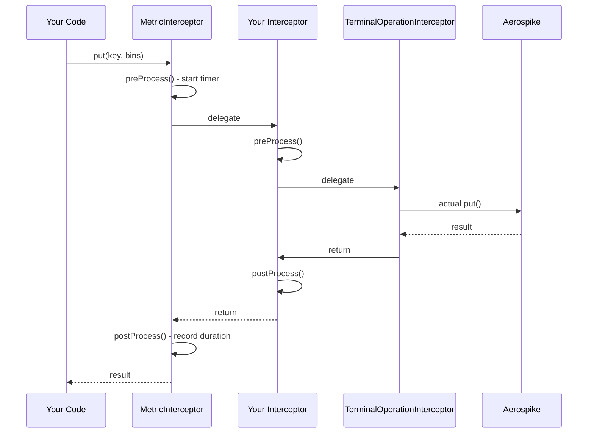

# Interceptors

Interceptors provide a pluggable mechanism to hook into every Aerospike operation performed through the bundle. They follow a **chain-of-responsibility** pattern -- each interceptor can execute logic before and after an operation, then delegate to the next interceptor in the chain.

## How Interceptors Work



## Built-in Interceptors

| Interceptor | Role |
|-------------|------|
| `MetricInterceptor` | Always the outermost interceptor. Records operation timing and counts using Dropwizard Metrics. |
| `TerminalOperationInterceptor` | Always the innermost interceptor. Executes the actual Aerospike client call. |

## Writing a Custom Interceptor

Implement the `AerospikeInterceptor` interface:

```java
import com.phonepe.aerospike.interceptors.AerospikeInterceptor;
import com.phonepe.aerospike.interceptors.AerospikeInterceptorContext;

public class LoggingInterceptor extends AerospikeInterceptor {

    @Override
    public void preProcess(AerospikeInterceptorContext context) {
        log.info("Operation: {} on namespace: {}, set: {}",
            context.getOperation(),
            context.getNamespace(),
            context.getSetName());
    }

    @Override
    public void postProcess(AerospikeInterceptorContext context) {
        log.info("Operation completed: {}", context.getOperation());
    }
}
```

## Registering Interceptors

Register interceptors **before** the bundle's `run()` method is called (typically in `initialize()`), or immediately after:

```java
aerospikeBundle.registerInterceptor(new LoggingInterceptor());
aerospikeBundle.registerInterceptor(new AuditInterceptor());
```

Interceptors are invoked in the order they are registered (outermost to innermost), with `MetricInterceptor` always wrapping them all.

## AerospikeInterceptorContext

The context object passed to each interceptor contains:

| Field | Description |
|-------|-------------|
| `operation` | The `AerospikeOperation` enum (GET, PUT, DELETE, etc.) |
| `namespace` | Target namespace |
| `setName` | Target set |
| `keys` | Keys involved (if `interceptorContextKeyPopulationEnabled` is true) |
| `requestInfo` | Additional request metadata |

## Size Metrics

When `sizeMetricsEnabled: true` in your configuration, the client emits size metrics for `String` and `byte[]` bins, helping you monitor record sizes.

## See Also

- [Usage Guide](../usage.md) -- how to wire interceptors in your application
- [API Reference](api-reference.md) -- full method signatures
- [Default Mode](../modes/default-mode.md) -- how the interceptor chain is built
