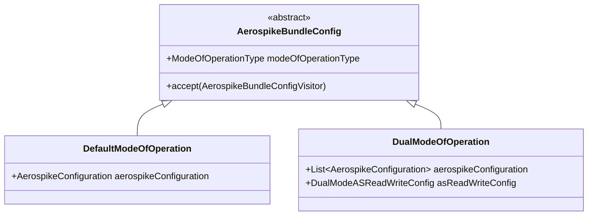

# Modes of Operation

Aerospike Bundle supports two modes of operation, controlled by the `modeOfOperationType` field in your configuration. This page explains when and why you would choose each mode.

## Overview

| Mode | Use Case | Clusters |
|------|----------|----------|
| [Default Mode](../modes/default-mode.md) | Single-cluster setup | 1 |
| [Dual Mode](../modes/dual-mode.md) | Multi-cluster routing (migration, DR) | 2+ |

## Default Mode (`DEFAULT_MODE`)

The simplest and most common setup. The bundle connects to a single Aerospike cluster and all operations (reads, writes, scans, queries) go to that cluster.

```yaml
aerospike:
  modeOfOperationType: DEFAULT_MODE
  aerospikeConfiguration:
    id: "primary"
    hosts:
      - host: "localhost"
        port: 3000
```

**Choose Default Mode when:**

- You have a single Aerospike cluster
- You don't need to split reads and writes across clusters
- You want the simplest operational setup

For full details, see [Default Mode Internals](../modes/default-mode.md).

## Dual Mode (`DUAL_MODE`)

Connects to multiple Aerospike clusters and routes reads and writes independently based on a configurable routing strategy. The routing can be changed dynamically at runtime.

```yaml
aerospike:
  modeOfOperationType: DUAL_MODE
  aerospikeConfiguration:
    - id: "cluster-a"
      hosts:
        - host: "cluster-a.example.com"
          port: 3000
    - id: "cluster-b"
      hosts:
        - host: "cluster-b.example.com"
          port: 3000
  asReadWriteConfig:
    readClusterId: "cluster-a"
    writeClusterId: "cluster-a"
```

**Choose Dual Mode when:**

- You are migrating between clusters and need gradual traffic shifting
- You need disaster recovery with read failover to a replica
- You want to separate read and write traffic across clusters

For full details, see [Dual Mode Internals](../modes/dual-mode.md).

## Configuration Class Hierarchy



The bundle uses a visitor pattern (`AerospikeBundleConfigVisitor`) to handle mode-specific initialization, so you never need to write `if/else` logic around modes yourself.

## See Also

- [Usage Guide](../usage.md) -- configuration examples for both modes
- [Default Mode](../modes/default-mode.md) -- single-cluster internals
- [Dual Mode](../modes/dual-mode.md) -- multi-cluster internals
- [Defaults & Configuration](defaults.md) -- policy defaults for all modes
