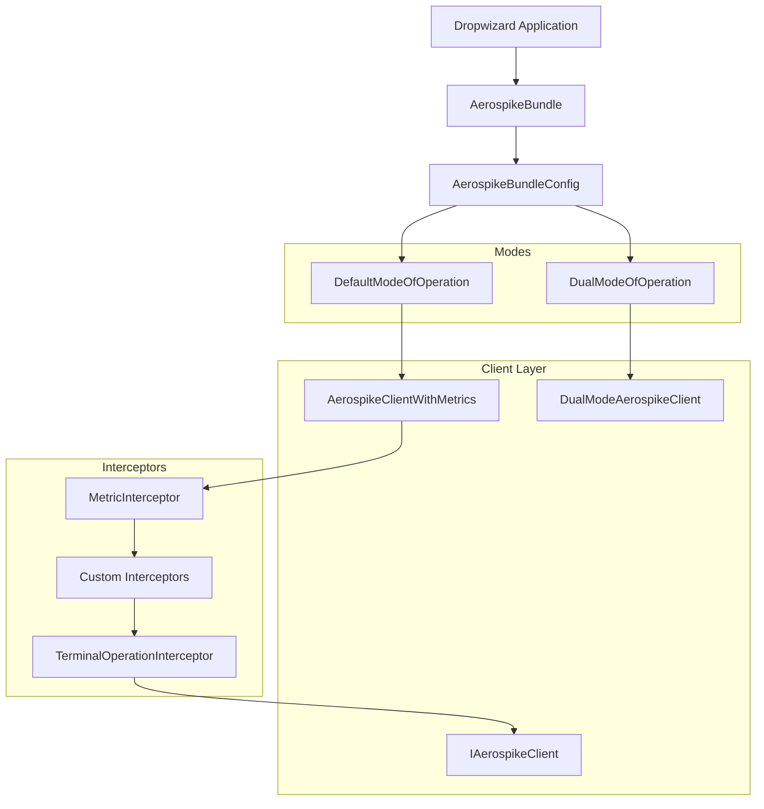

# Aerospike Bundle

Aerospike Bundle is a [Dropwizard](https://www.dropwizard.io/) bundle that simplifies connecting to and operating with [Aerospike](https://aerospike.com/) clusters. It provides automatic client lifecycle management, configurable policies, health checks, metrics, interceptors, and support for dual-mode (multi-cluster) operations.

## Why Aerospike Bundle?

When building Dropwizard services that interact with Aerospike, you typically need to handle:

- Client creation and lifecycle management
- Policy configuration (read, write, scan, query, batch)
- Health checks
- Metrics collection
- TLS configuration
- Multi-cluster routing (dual-mode)

Aerospike Bundle handles all of this with a simple, declarative configuration.

## Key Features

| Feature | Description |
|---------|-------------|
| **Dropwizard Integration** | Seamless lifecycle management via `ConfiguredBundle` |
| **Configurable Policies** | Fine-grained control over read, write, scan, query, and batch policies |
| **Health Checks** | Automatic Aerospike cluster health monitoring |
| **Metrics & Interceptors** | Built-in metric collection and pluggable interceptor chain |
| **Dual-Mode Operations** | Route reads/writes to different clusters for migration or DR |
| **TLS Support** | Configurable TLS policies and protocols |
| **Namespace Management** | Tag-based namespace resolution |
| **XDR Lag Monitoring** | Cross-datacenter replication lag visibility |

## Architecture

## What to Read Next

- [Usage Guide](usage.md) -- dependency setup, configuration, and code examples.
- [Interceptors](concepts/interceptors.md) -- understand and extend the interceptor chain.
- [Modes of Operation](concepts/modes.md) -- choose between single and multi-cluster setups.
- [Namespaces](concepts/namespaces.md) -- tag-based namespace resolution.
- [API Reference](concepts/api-reference.md) -- full method signatures and types.
- [Defaults & Configuration](concepts/defaults.md) -- all configurable values and their defaults.
- [Error Codes](concepts/error-codes.md) -- troubleshooting common errors.
