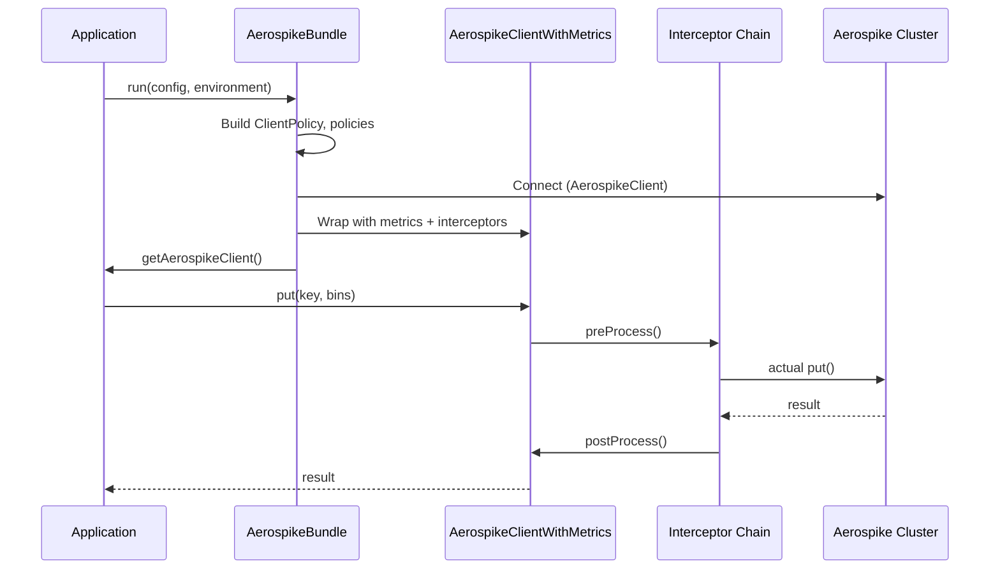

# Default Mode

The default mode (`DEFAULT_MODE`) connects to a single Aerospike cluster and wraps the client with metrics and interceptors.

## How It Works



## Configuration

```java
@Data
public class DefaultModeOfOperation extends AerospikeBundleConfig {
    private AerospikeConfiguration aerospikeConfiguration;
}
```

```yaml
aerospike:
  modeOfOperationType: DEFAULT_MODE
  aerospikeConfiguration:
    id: "primary"
    hosts:
      - host: "localhost"
        port: 3000
    retries: 5
    maxConnectionsPerNode: 10
    healthcheckEnabled: true
```

## Interceptor Chain

The interceptor chain is built in this order (outermost first):

1. **MetricInterceptor** -- records operation timing and counts
2. **Custom interceptors** -- registered via `registerInterceptor()`
3. **TerminalOperationInterceptor** -- executes the actual Aerospike operation

## Health Check

When `healthcheckEnabled: true`, the bundle registers a Dropwizard health check named `aerospike-bundle-<id>` that verifies cluster connectivity.

## Lifecycle

The Aerospike client is automatically closed when the Dropwizard application shuts down.
