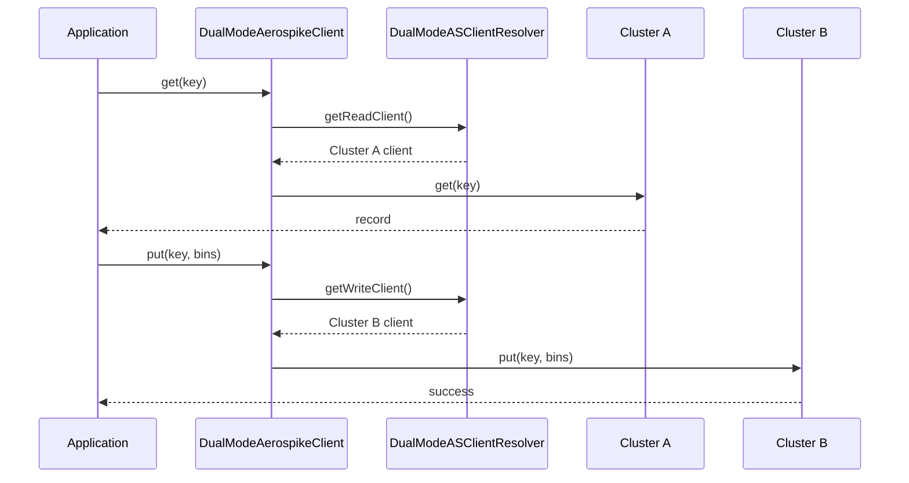

# Dual Mode

The dual mode (`DUAL_MODE`) connects to multiple Aerospike clusters and routes reads/writes based on a configurable routing strategy.

## Use Cases

- **Live migration:** Gradually shift traffic from one cluster to another
- **Disaster recovery:** Route reads to a replica cluster when primary is degraded
- **Geographic routing:** Route to the nearest cluster

## How It Works



## Configuration

```yaml
aerospike:
  modeOfOperationType: DUAL_MODE
  aerospikeConfiguration:
    - id: "cluster-a"
      hosts:
        - host: "cluster-a.example.com"
          port: 3000
      healthcheckEnabled: true
    - id: "cluster-b"
      hosts:
        - host: "cluster-b.example.com"
          port: 3000
      healthcheckEnabled: true
  asReadWriteConfig:
    readClusterId: "cluster-a"
    writeClusterId: "cluster-b"
```

## Dynamic Routing

Override `refreshDualModeASReadWriteConfig()` to dynamically change which cluster handles reads vs writes at runtime:

```java
@Override
protected Supplier<DualModeASReadWriteConfig> refreshDualModeASReadWriteConfig(
        MyAppConfiguration config) {
    return () -> {
        // Fetch from config service, feature flag, etc.
        return DualModeASReadWriteConfig.builder()
            .readClusterId("cluster-b")
            .writeClusterId("cluster-b")
            .build();
    };
}
```

## Validation

- All cluster IDs must be unique
- `readClusterId` and `writeClusterId` must reference valid cluster IDs from the configuration
- Each cluster gets its own health check: `aerospike-bundle-<id>`

## DualModeASClientResolver

This is a Dropwizard `Managed` object that periodically refreshes the read/write routing configuration. It maintains a map of cluster ID to `IAerospikeClient` and resolves the appropriate client for each operation type.
